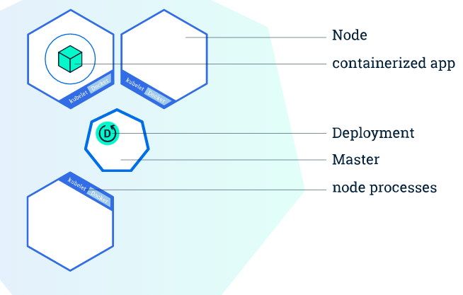

# Deployment

- [What is Deployment](# What is Deployment)
- [The status of a Deployment](#The status of a Deployment)
- [Update Deployment](#)
  - [Rolling back a Deployment](# Rolling back a Deployment)
  - [Checking Rollout History of a Deployment](# Checking Rollout History of a Deployment)
  - [Rolling Back to a Previous Revision](# Rolling Back to a Previous Revision)
  - [Pausing and Resuming a Deployment](# Pausing and Resuming a Deployment)
- [Deployment spec](# Deployment spec)

## What is Deployment
A **Deployment** provides declarative updates for **Pods** and **Replica Sets** (the next-generation Replication Controller). You only need to describe the desired state in a Deployment object, and the Deployment controller will change the actual state to the desired state at a controlled rate for you.

A typical use case is:
- Create a Deployment to bring up a Replica Set and Pods.
- Check the status of a Deployment to see if it succeeds or not.
- Later, update that Deployment to recreate the Pods.
- Rollback to an earlier Deployment revision if the current Deployment isn't stable.
- Pause and resume a Deployment.



## The status of a Deployment
```console
$ kubectl rollout status deployment/nginx-deployment
deployment nginx-deployment successfully rolled out
```

This verifies the Deployment’s `.status.observedGeneration` >= `.metadata.generation`, and its up-to-date replicas (`.status.updatedReplicas`) matches the desired replicas (`.spec.replicas`) to determine if the rollout succeeded. If the rollout is still in progress, it watches for Deployment status changes and prints related messages.

## Rolling back a Deployment
Sometimes you may want to rollback a Deployment. By default, all of the Deployment's rollout history is kept in the system so that you can rollback anytime you want (by specifying revision history limit)

A Deployment's revision is created when a Deployment's rollout is triggered. This means that the new revision is created if and only if the Deployment's pod template is changed (ex: update label or container image). Other updates such as scaling the Deployment will not create a Deployment revision. This implies that when you rollback to an earlier revision, only the Deployment's pod template part will be rolled back.

## Checking Rollout History of a Deployment
```console
$ kubectl rollout history deployment/nginx-deployment
deployments "nginx-deployment":
REVISION    CHANGE-CAUSE
1           kubectl create -f docs/user-guide/nginx-deployment.yaml --record
2           kubectl set image deployment/nginx-deployment nginx=nginx:1.9.1
3           kubectl set image deployment/nginx-deployment nginx=nginx:1.91
```
We can easily see the changes because we recorded the command using `--record` flag before. To futher see the details of each revision, run:
```console
$ kubectl rollout history deployment/nginx-deployment --revision=2
```

## Rolling Back to a Previous Revision
Undo the current rollout and rollback to the previous revision:
```console
$ kubectl rollout undo deployment/nginx-deployment
deployment "nginx-deployment" rolled back
```

Alternatively, you can rollback to a specific revision by specifying `--to-revision` flag:
```console
$ kubectl rollout undo deployment/nginx-deployment --to-revision=2
deployment "nginx-deployment" rolled back
```

## Pausing and Resuming a Deployment
A use case is to support canary deployment. You can also pause a Deployment mid-way and then resume it during the rollout period:
```console
$ kubectl set image deployment/nginx-deployment nginx=nginx:1.9.1
$ kubectl rollout pause deployment/nginx-deployment
deployment "nginx-deployment" image updated
deployment "nginx-deployment" paused
```

To resume the Deployment, simply do:
```console
$ kubectl rollout resume deployment/nginx-deployment
```

## Deployment spec
### Strategy

`.spec.strategy` specifies the strategy used to replace old Pods by new ones. `.spec.strategy.type` can be "Recreate" or "RollingUpdate". "RollingUpdate" is the default value.

**Recreate Deployment**
All existing Pods are killed before new ones are created when `.spec.strategy.type==Recreate`

**Rolling Update Deployment**
The Deployment updates Pods in a rolling update fashion when `.spec.strategy.type==RollingUpdate`. You can specify `maxUnavailable` and `maxSurge` to control the rolling update process.

- Max Unavailable: `.spec.strategy.rollingUpdate.maxUnavailable` specifies the maximum number of Pods that can be unavailable during the update process. The value can be an absolute number (ex: 5) or a percentage of desired Pods (ex: 10%)
- Max Surge: `.spec.strategy.rollingUpdate.maxSurge` specifies the maximum number of Pods can be created above the desired number of Pods. The value can be an absolute number (ex: 5) or a percentage of desired Pods (ex: 10%)

### Rollback To
`.spec.rollbackTo` specifies with the configuration the Deployment is rolling back to. Setting this field will trigger a rollback, and this field will be cleared every time a rollback is done.

- `.spec.rollbackTo.revision` specifies the revision to rollback to. Default to 0 meaning rollback to the last revision in history.
